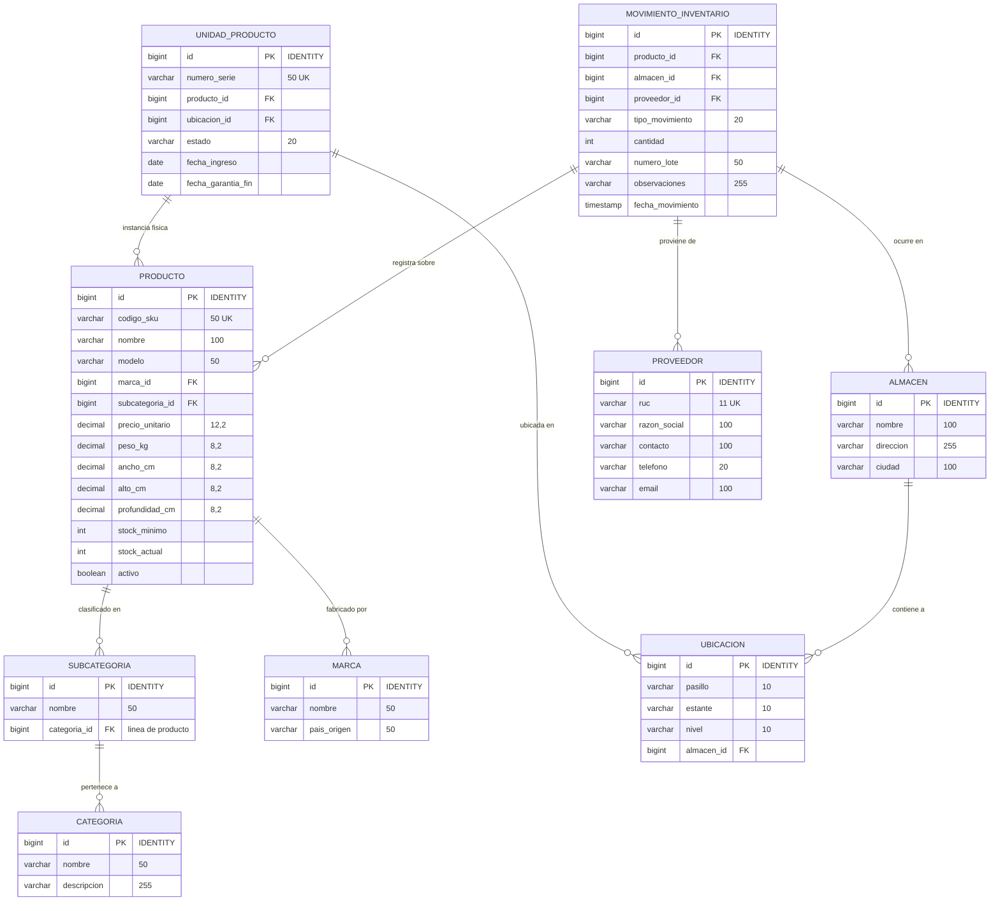

# DistribuMax — Sistema de Gestión de Inventarios

Sistema empresarial de gestión de inventarios para una distribuidora de electrodomésticos para el hogar. Este proyecto implementa una arquitectura desacoplada de n-capas (**Clean Architecture / N-Tier** inspirada en el estándar profesional de ASP.NET) en **Java 24** con **Spring Boot 3.4.1**, persistencia en **SQL Server** mediante un **Snowflake Schema (Esquema de Copo de Nieve)** y un cliente web interactivo en **HTML5/CSS3 puro** (Vanilla JavaScript con Fetch API).

---

## 🏗️ Arquitectura del Sistema (Estilo ASP.NET)

El backend está diseñado bajo la separación estricta de responsabilidades, aislando la lógica del dominio, los casos de uso de la aplicación, la infraestructura de persistencia y la exposición de la API REST.

```
inventario-electrodomesticos/
├── pom.xml                               # Configuración de dependencias (Spring Boot + SQL Server)
└── src/main/java/com/distribumax/inventario/
    ├── InventarioApplication.java        # Punto de entrada (Entry point)
    │
    ├── domain/                           # 1. CAPA DE DOMINIO (Core)
    │   ├── model/                        # 9 Entidades JPA (POJOs Puros)
    │   │   └── enums/                    # Enums de estado y tipo
    │   ├── exception/                    # Excepciones personalizadas del dominio
    │   └── repository/                   # Contratos de repositorios (Puertos de acceso)
    │
    ├── application/                      # 2. CAPA DE APLICACIÓN (Use Cases)
    │   ├── dto/                          # 7 Objetos de Transferencia de Datos (DTOs)
    │   └── service/                      # Lógica de negocio y orquestación de servicios
    │
    ├── infrastructure/                   # 3. CAPA DE INFRAESTRUCTURA (Adapters)
    │   └── config/                       # WebConfig (CORS) y DataInitializer (Seed Data)
    │
    └── presentation/                     # 4. CAPA DE PRESENTACIÓN (REST API)
        ├── controller/                   # 5 Controladores REST (Mapeo de Endpoints)
        └── exception/                    # Gestor global de excepciones (GlobalExceptionHandler)
```

### Descripción de las Capas

*   **Capa de Dominio (`domain`)**: Contiene las entidades puras del negocio (`Producto`, `MovimientoInventario`, etc.) con sus reglas internas, los enumerados y las interfaces de repositorio que actúan como puertos. No tiene dependencias de frameworks externos excepto JPA para el mapeo.
*   **Capa de Aplicación (`application`)**: Implementa los casos de uso de la aplicación (como `registrarEntrada`, `registrarSalida` o `obtenerResumen`). Consume las interfaces de los repositorios y mapea las entidades a DTOs.
*   **Capa de Infraestructura (`infrastructure`)**: Provee implementaciones técnicas. Aquí se configura CORS (`WebConfig`) y el cargador de datos semilla (`DataInitializer`).
*   **Capa de Presentación (`presentation`)**: Expone los endpoints REST para interactuar asíncronamente con el cliente y gestiona de manera centralizada los errores del sistema (`GlobalExceptionHandler`).

---

## 🛠️ Refactorización de Compatibilidad Nativa (Java 24)

Con el fin de evitar conflictos críticos en el preprocesamiento de anotaciones del compilador (`javac`) bajo **JDK 24+**, el proyecto se migró de forma quirúrgica de Lombok a Java Puro.

### Detalles de la Migración
1.  **Eliminación Completa de Lombok**: Se erradicó la dependencia `org.projectlombok:lombok` y sus configuraciones de compilación en el archivo `pom.xml`.
2.  **POJOs Puros Tradicionales**:
    *   Se reemplazaron las anotaciones `@Data`, `@Getter`, `@Setter`, `@Builder`, `@NoArgsConstructor` y `@AllArgsConstructor` en entidades y DTOs.
    *   Se implementaron manualmente todos los métodos *Getter* y *Setter*, constructores con argumentos y constructores vacíos requeridos por Hibernate.
3.  **Remoción de `@RequiredArgsConstructor`**:
    *   Los controladores REST (`presentation.controller`) y servicios (`application.service`) se refactorizaron para usar la inyección de dependencias clásica de Spring a través de constructores explícitos declarados manualmente.
4.  **Sustitución del Patrón Builder**:
    *   Todas las instanciaciones que utilizaban constructores fluidos (`.builder()`) en la capa de servicios y en la inicialización de datos de prueba (`DataInitializer`) fueron convertidas al patrón estándar de instanciación con el operador `new` y llamadas sucesivas a métodos `set`.
5.  **Modernización de Dependencias**:
    *   Se actualizó el parent de Spring Boot a la versión **3.4.1**, garantizando un soporte óptimo para JDK 24.
    *   Se eliminó la configuración explícita del dialecto de SQL Server (`hibernate.dialect`), permitiendo que **Hibernate 6.4+** autodetecte la base de datos de manera nativa evitando advertencias de obsolescencia (*deprecation*).

---

## 🗄️ Diseño de Base de Datos: Copo de Nieve (Snowflake Schema)

El modelo relacional sigue la estructura de **Copo de Nieve**, ideal para almacenamiento de datos normalizado (Data Warehouse) enfocado en análisis y trazabilidad del inventario.

### Diagrama Entidad-Relación



### Descripción de las Tablas en SQL Server

| Tabla | Tipo / Rol | Descripción |
|---|---|---|
| `movimientos_inventario` | **Tabla de Hechos** | Almacena las transacciones físicas de entrada y salida de mercancía. |
| `productos` | **Dimensión Central** | Entidad de negocio que consolida los datos maestros del electrodoméstico. |
| `unidades_producto` | **Dimensión Detalle** | Unidades físicas serializadas (`numero_serie` único) para control de garantías. |
| `subcategorias` | **Dimensión Copo de Nieve** | Clasificación secundaria que apunta a su categoría padre. |
| `categorias` | **Dimensión Copo de Nieve** | Clasificación macro (ej. Línea Blanca, Línea Marrón). |
| `marcas` | **Dimensión** | Fabricantes del producto con su país de procedencia. |
| `proveedores` | **Dimensión** | Empresas que surten lotes de productos (identificadas por RUC). |
| `ubicaciones` | **Dimensión Copo de Nieve** | Localizaciones exactas (pasillo, estante, nivel) vinculadas a un almacén. |
| `almacenes` | **Dimensión** | Espacios físicos de almacenamiento de la distribuidora. |

---

## 💻 Interfaz Web de Usuario (Frontend Premium)

La interfaz se despliega a través de archivos estáticos puros (`index.html`, `styles.css`, `app.js`) alojados en el backend de Spring Boot, comunicándose de forma asíncrona mediante JSON.

*   **Diseño Visual (Aesthetics)**: Tema oscuro estilizado con efectos de *glassmorphism* (fondos translúcidos), gradientes de color sutiles y micro-animaciones en tarjetas KPI.
*   **Secciones del Dashboard**:
    *   **KPIs en Tiempo Real**: Tarjetas interactivas con el valor total del inventario, total de SKU de productos, unidades físicas, alertas de stock bajo y movimientos del día.
    *   **Inventario Maestro**: Tabla dinámica con filtros inteligentes (búsqueda textual por nombre/modelo/SKU, filtrado por Marca y Categoría).
    *   **Panel de Alertas**: Resaltado visual en tonos rojizos para productos que están por debajo de su stock mínimo de seguridad.
    *   **Historial de Movimientos**: Registro cronológico de ingresos y salidas con detalles de lotes y almacenes.
*   **Operaciones Soportadas (CRUD en Modales)**:
    *   Creación, edición y eliminación lógica de productos.
    *   Registro de Entradas de Lote (asocia proveedor, almacén, ubicación, cantidad, número de lote e inserta dinámicamente números de serie únicos).
    *   Registro de Salidas de Inventario.

---

## 📡 Endpoints del API REST

La API expone un conjunto completo de endpoints para el frontend:

| Método | Endpoint | Capa / Servicio | Descripción |
|---|---|---|---|
| `GET` | `/api/productos` | `ProductoController` | Obtener catálogo de productos con filtros de marca/categoría. |
| `GET` | `/api/productos/{id}` | `ProductoController` | Obtener la información detallada de un producto. |
| `POST` | `/api/productos` | `ProductoController` | Crear un nuevo producto (valida SKU único). |
| `PUT` | `/api/productos/{id}` | `ProductoController` | Modificar atributos del producto. |
| `DELETE` | `/api/productos/{id}` | `ProductoController` | Eliminar lógicamente un producto (soft delete). |
| `GET` | `/api/productos/{id}/unidades` | `ProductoController` | Listar todas las unidades serializadas físicas de ese producto. |
| `POST` | `/api/inventario/entrada` | `InventarioController` | Registrar ingreso de mercancía, crea series y movimientos. |
| `POST` | `/api/inventario/salida` | `InventarioController` | Registrar egreso de mercancía por venta o merma. |
| `GET` | `/api/dashboard` | `DashboardController` | Retorna los KPIs agregados para la pantalla de inicio. |
| `GET` | `/api/dashboard/alertas` | `DashboardController` | Retorna la lista de productos en estado de desabastecimiento. |
| `GET` | `/api/movimientos` | `MovimientoController` | Consultar histórico de transacciones (entrada/salida). |
| `GET` | `/api/catalogo/categorias` | `CatalogoController` | Obtener listado de categorías para selectores. |
| `GET` | `/api/catalogo/subcategorias` | `CatalogoController` | Obtener subcategorías. |
| `GET` | `/api/catalogo/marcas` | `CatalogoController` | Obtener listado de marcas. |
| `GET` | `/api/catalogo/proveedores` | `CatalogoController` | Obtener listado de proveedores. |
| `GET` | `/api/catalogo/almacenes` | `CatalogoController` | Obtener listado de almacenes. |

---

## 🚀 Guía de Ejecución

Sigue estos pasos para compilar, configurar e iniciar el proyecto en tu entorno local.

### Prerrequisitos
1.  **JDK 24** (o superior) instalado y configurado en tus variables de entorno (`JAVA_HOME`).
2.  **SQL Server** en funcionamiento (Local o Remoto) en el puerto estándar `1433`.
3.  **Maven** (opcional, o puedes importar el proyecto directamente en tu IDE favorito: IntelliJ, Eclipse, VS Code).

### Paso 1: Configurar la Base de Datos

Inicia sesión en tu instancia de SQL Server y ejecuta la creación de la base de datos:

```sql
CREATE DATABASE inventario_electrodomesticos;
GO
```

> **NOTA:** Las tablas del esquema Snowflake se generarán de manera automática cuando la aplicación se ejecute por primera vez, gracias a la propiedad `spring.jpa.hibernate.ddl-auto=update` configurada en el backend.

### Paso 2: Editar la Configuración del Sistema

Abre el archivo [application.properties](file:///c:/Users/bryan/Desktop/UNMSM/CICLO%202026%20-%201/Sistemas%20Operativos/Proyecto%20Jhair/inventario-electrodomesticos/src/main/resources/application.properties) y actualiza las credenciales de tu base de datos local:

```properties
spring.datasource.url=jdbc:sqlserver://localhost:1433;databaseName=inventario_electrodomesticos;encrypt=true;trustServerCertificate=true
spring.datasource.username=tu_usuario_sql
spring.datasource.password=tu_contrasena_sql
```

### Paso 3: Compilar y Ejecutar

Abre una consola de comandos en la carpeta raíz del proyecto backend (`inventario-electrodomesticos`) y ejecuta:

```bash
# Limpiar y compilar el proyecto
mvn clean compile

# Levantar el servidor de desarrollo Spring Boot
mvn spring-boot:run
```

### Paso 4: Acceder a la Aplicación
Una vez que en la consola se muestre que el servidor arrancó con éxito en el puerto `8080`, abre tu navegador e ingresa a:
👉 [http://localhost:8080](http://localhost:8080)

---

## 🌱 Inicialización Automática de Datos (Seed Data)

Para facilitar las pruebas, el inicializador de base de datos (`DataInitializer.java`) inserta automáticamente los siguientes datos semilla la primera vez que detecta las tablas vacías:

*   **3 Categorías principales**: *Línea Blanca*, *Línea Marrón* y *Pequeños Electrodomésticos*.
*   **8 Subcategorías**: Refrigeradoras, Lavadoras, Cocinas, Televisores, Sonido, Licuadoras, Planchas y Microondas.
*   **5 Marcas globales**: Samsung, LG, Bosch, Whirlpool y Oster.
*   **3 Proveedores**: Samsung Electronics Perú, LG Electronics Perú y Distribuidora Multihogar.
*   **2 Almacenes**: *Almacén Central Lima* (con 5 ubicaciones) y *Almacén Norte* (con 2 ubicaciones).
*   **12 Productos maestros**: Incluye refrigeradoras, televisores de 55" y 65", soundbars, licuadoras, etc.
    *   *Nota*: 4 de estos productos se inicializan deliberadamente con un stock inferior a su mínimo requerido para demostrar la funcionalidad de alertas.
*   **18 Unidades físicas**: Registradas con números de serie únicos para control de garantías.
*   **6 Movimientos históricos**: Ingresos y egresos ya procesados para el renderizado del historial.
